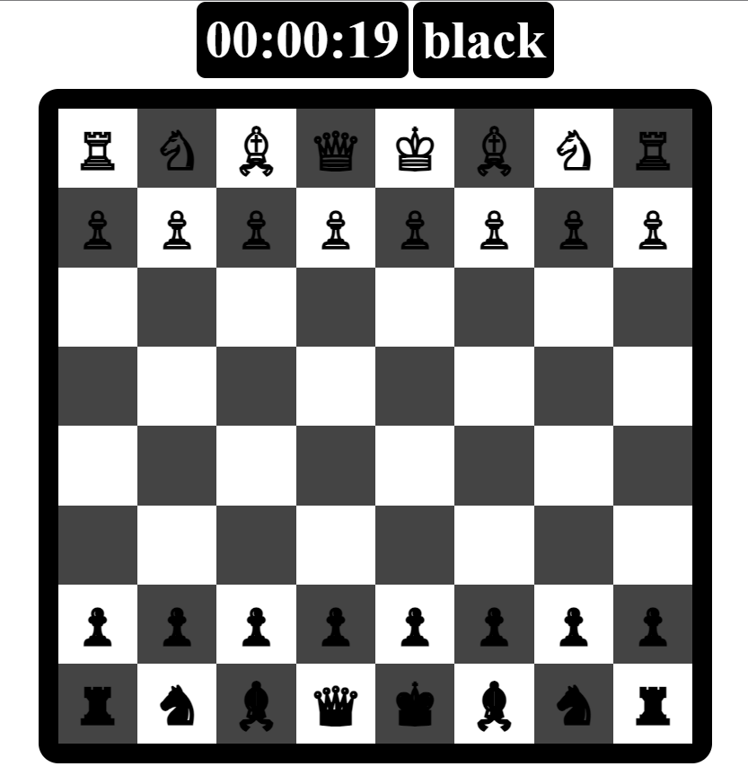

# Chess
 Chess game with computer player



A simple two-player chess game implemented in JavaScript. Enjoy classic chess on your web browser with a friend, all offline.

## Features

- Two-player chess.
- Intuitive interface.
- Legal move validation.
- Highlights for selected pieces and legal moves.
- Checkmate detection.
- Supports castling, en passant, and pawn promotion.

## Demo

Play the game [here](https://2hasan2.github.io/Chess/).

## Getting Started

1. Clone this repository to your local machine:

   ```bash
   git clone https://github.com/2Hasan2/Chess.git
    ```

2. Open `index.html` in your browser use live server.

## Usage

- Click on a piece to select it.
- Click on a highlighted square to move the selected piece to that square.
- Click on the same piece again to deselect it.

## Built With

- HTML
- CSS
- JavaScript

## author

- **Hasan Ragab** - [2Hasan2](https://github.com/2Hasan2/)